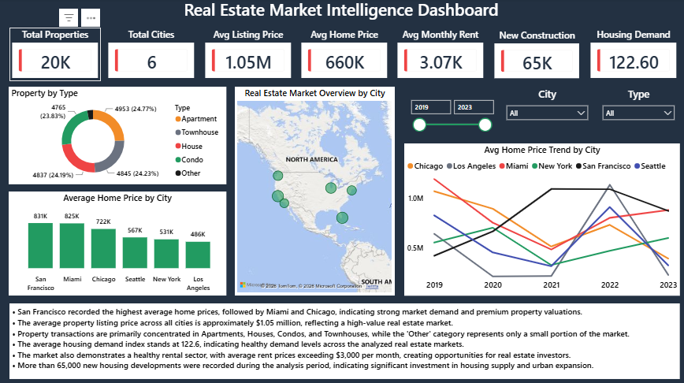
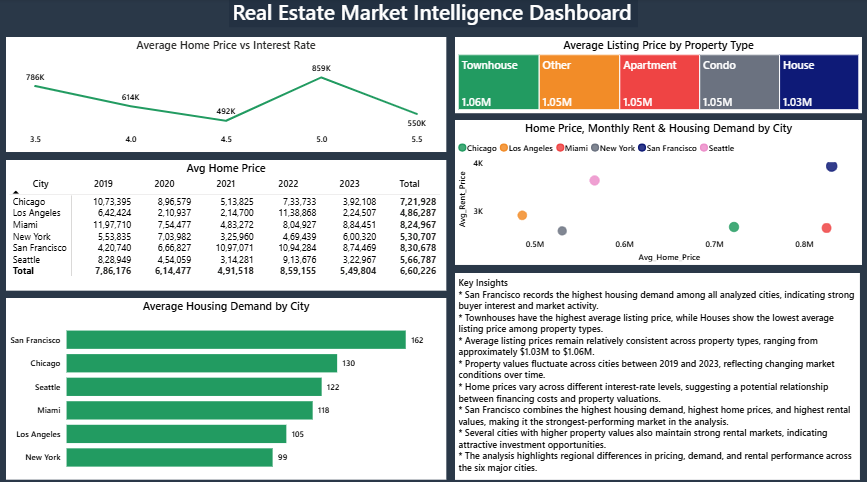
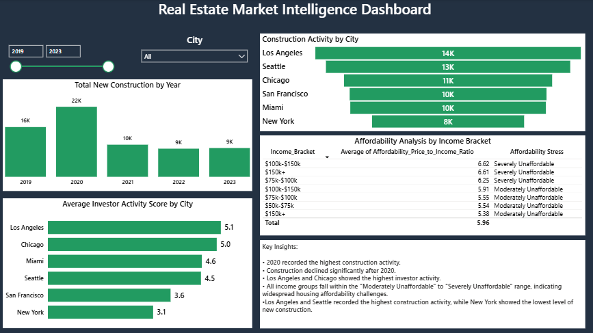

# 🏡 Real Estate Market Analysis using SQL, Python & Power BI

An end-to-end Data Analytics project that analyzes real estate market trends, property prices, housing demand, affordability, investor activity, and construction trends using **MySQL, Python, and Power BI**.

The project follows a complete analytics workflow from data validation and exploratory data analysis (EDA) to interactive dashboard development and business insights.

---

# 📌 Project Overview

This project focuses on analyzing real estate market performance across multiple cities to answer important business questions such as:

- Which cities have the highest home prices?
- How do property prices vary by property type?
- Which cities have the highest housing demand?
- How does new construction impact home prices?
- Which income groups face affordability challenges?
- How do interest rates influence housing prices?
- Which cities attract the highest investor activity?

---

# 🛠️ Tools & Technologies

- **MySQL**
- **Python**
- **Power BI**
- **Microsoft Excel**

---

# 📂 Project Files

| File | Description |
|------|-------------|
| `market.csv` | Market trends and economic indicators dataset |
| `properties.csv` | Property listings and transaction dataset |
| `real_estate.sql` | SQL queries for business analysis |
| `real_estate.ipynb` | Python EDA, validation, and analysis |
| `real_estate.pbix` | Interactive Power BI dashboard |

---

# 🔄 Project Workflow

```text
Raw CSV Data
      │
      ▼
Python
(Data Cleaning & Validation)
      │
      ▼
MySQL
(Business Analysis)
      │
      ▼
Power BI
(Interactive Dashboard)
      │
      ▼
Business Insights
```

---

# 📊 Analysis Performed

### ✔ Data Validation

- Dataset overview
- Total records analysis
- Invalid listing price detection
- Duplicate transaction check
- Property size validation

---

### ✔ Property Pricing Analysis

- Average Listing Price by Property Type
- Property Distribution by Type
- Listing Price Range Analysis

---

### ✔ Market Trend Analysis

- Average Home Price by City
- Year-over-Year Home Price Growth
- Highest Property Values by Year
- Lowest Property Values by Year

---

### ✔ Housing Demand Analysis

- Housing Demand by City
- Home Price vs Housing Demand
- Average Rental Price Analysis

---

### ✔ Investor Analysis

- Investor Activity Ranking
- City-wise Investment Analysis

---

### ✔ Affordability Analysis

- Price-to-Income Ratio
- Income Bracket Analysis
- Affordability Stress Classification

---

### ✔ Construction & Supply Analysis

- New Construction by Year
- Construction Activity by City
- Construction vs Home Price

---

### ✔ Interest Rate Analysis

- Interest Rate vs Average Home Price
- Home Price Trend Analysis

---

# 📈 Dashboard Preview

## 🏠 Real Estate Market Overview



---

## 📈 Market Trends & Demand Analysis



---

## 🏗️ Supply, Investment & Affordability Analysis



---

# 📌 Key Business Insights

- San Francisco recorded the highest average home prices.
- Miami maintained strong property valuations across multiple years.
- Los Angeles and Chicago showed the highest investor activity.
- Seattle demonstrated balanced housing demand and affordability.
- Housing affordability challenges were observed across all income groups.
- Construction activity peaked in 2020 before moderating in later years.
- Interest rates showed an inverse relationship with average home prices.
- Housing demand, investor confidence, construction activity, and affordability collectively influence real estate market performance.

---

# 💡 Skills Demonstrated

- Data Cleaning
- Data Validation
- Exploratory Data Analysis (EDA)
- SQL Queries
- Aggregate Functions
- Window Functions
- Common Table Expressions (CTEs)
- Business Analysis
- Power BI Dashboard Development
- Data Visualization
- Business Insight Generation
- Python (Pandas, NumPy, Matplotlib)
- MySQL

---

# 📁 Repository Structure

```text
Real-Estate-Market-Analysis
│
├── Market_Trends_Demand_Analysis.png
├── README.md
├── Supply_Investment_Affordability_Analysis.png
├── market.csv
├── properties.csv
├── real_estate.ipynb
├── real_estate.pbix
├── real_estate.sql
└── real_estate_market_overview.png
```

---

# 🎯 Learning Outcomes

This project strengthened my understanding of:

- SQL for business problem-solving
- Python for data analysis and validation
- Power BI dashboard development
- KPI design and visualization
- Data storytelling
- End-to-end data analytics workflow

---

# 👨‍💻 Author

**Rahul Chhabra**

🔗 **LinkedIn:**  
https://www.linkedin.com/in/rahulchhabra-data-analyst

💻 **GitHub:**  
https://github.com/ssdnrahul

---

⭐ If you found this project useful, consider giving it a star!
